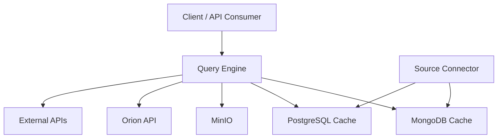

## Architecture

```mermaid
graph TD

  %% Client layer
  A[Client / API Consumer] --> D[Query Engine]

  %% Orchestration layer
  D --> B[MongoDB Cache]
  D --> C[PostgreSQL Cache]

  %% External orchestration targets
  D --> E[MinIO]
  D --> F[Orion API]
  D --> G[External APIs]

  %% Optional ingestion flow (se esiste davvero push)
  S[Source Connector] --> B
  S --> C
```