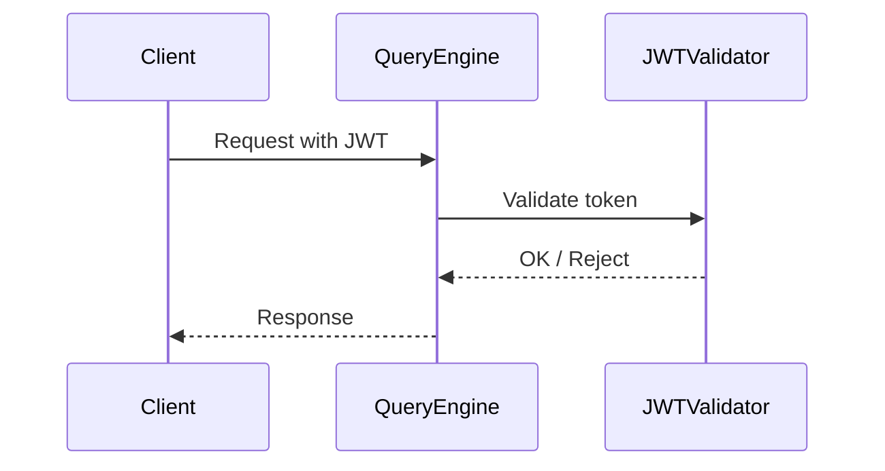

# Authentication

The system supports JWT-based authentication.

---

## Supported Providers

- Keycloak
- Any JWT provider

---

## Configuration

Public key must be defined in `config.js`

## Flow

